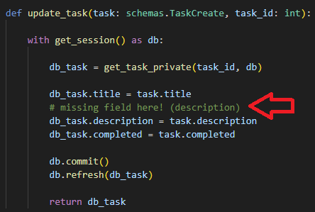
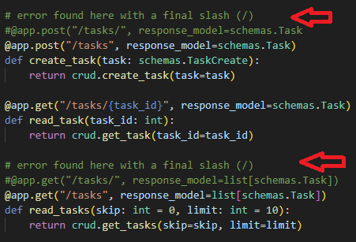
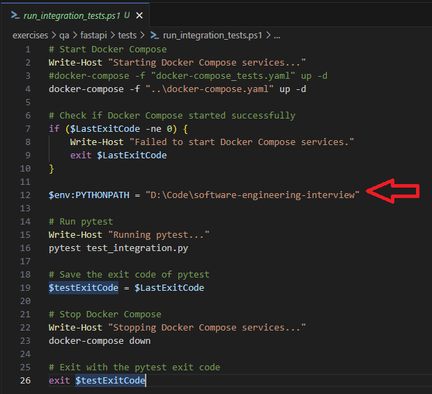

# FastAPI Exercise - OUTCOME

## Considerations / Summary

* The provided code was running fine, after fixing some errors

* For unit tests (/tests):
  * Some refactor was performed to have the business logic better organized and isolated
  * Pytest framework was used
  * I'd some problems extracting the code coverage, I'll better explain it during the interview

* For integration tests (/tests):
  * Docker was used to contain the testing database
  * A FastApi TestClient fixture was created to send the requests to our API
  * One significant integration test has been created
  * A PS script was created to:
    * Create and run the database image (docker-compose)
    * Run the integration test

* For load testing (/tests):
  * Locust was used to stress the /tasks endpoint
  * Report was created and added

* Test concepts/strategy questions have been answered in the below section

## Errors found in the code

* Error 1: The update_task() in crud.py does not update the 'description' field

  

* Error 2: Slash problems in endpoints (main.py). I'm not sure if this is really a problem, but I did have issues with the final slash (/) in these endpoints. Removing them solved the issue:

  

## Unit testing

### Refactor

Originally, the business logic -BL- (db conection, error management,..) was distributed among main.py and crud.py. I did the following:

* All the logic is now in crud.py
* To isolate the database comming from the input parameters to the methods, I created a context manager for the DB conection
* Now the code remains as follows:
  * crud.py => has all the business logic to be unit-tested
  * main.py => no remarkable business logic, just a link between the endpoint and the crud
  * database.py => no remarkable BL to test, and get_db() will be mocked
  * models.py => no remarkable BL to test
  * schemas.py => no remarkable BL to test
  
### Unit test implementation

* After the refactor, the test where implemented (tests/test_crud.py):
  * Targeted modules: crud, models, schemas
  * Mocking get_db() from database.py with MagicMock()
  * 4 test cases are provided (just a sample, should be more of them)
  * Assertions: received data, HttpException thrown, methods called...

### How to run the unit tests

* From the test explorer of VS Code (properly installing and configuring pytest before)

## Integration testing

### Summary

* The goal here is to have a real containerized testing database and an instance of our app running, so we can run API requests against it
* A FastApi TestClient fixture was created to send the requests to our API (tests/conftest.py)
* The database container has to be created and run before running all integration tests and removed after the run
* The table "tasks" has to be empty before any test execution
* I tried to run 'docker-compose' programatically from Python as a hook, but I was not successful. That's why I created a PS script (tests/run_integration_tests.ps1):
  * Building the image and run it
  * Running all integration tests (each test takes care for table cleanup)
  * Removing the image
* A single significant integration test was created to demonstrate the viability of the approach. Obviously, more should be created for a comprehensive coverage (tests/test_integration.py)

### How to run the integration tests

* If the docker image for the DB is up&running, from the test explorer of VS Code (properly installing and configuring pytest before)
* If we want the "full experience", run the PS1 script from a PS terminal. It will startup the testing DB and run only the integration tests (not unit tests):
    
  First of all modify the python path to match your project's root folder:

  

  Finally, execute the script:
  
  *> powershell -File "run_integration_tests.ps1"*

## Load testing

* Some load testing was performed with Locust against our API
* tests/locustfile.py => Endpoint configuration (will attach only the "/tasks" endpoint)
* Locust report can be found [here](others/locust_report.html) (is it better to open it directly from the file system)

## Test concepts/strategy questions

### How would you apply regression testing in this project?

* Regression testing is the capability to ensure the quality for existing functionality
* For that, we have to ensure a good coverage and proper test plan for existing functionality. This testing should be ideally 100% automated
* As far as the existing functionality changes or evolves, tests must be refactored in order to keep the verification updated
  

### If it were up to you, what stages would the life cycle of this application include to ensure a high quality standard?

* The quality should be integrated in all the SDLC stages during app development
* For waterfall approaches, it's more difficult to integrate the quality within the different stages (Plan, Develop, Test, Deploy and Maintain) and the undertainty is higher
* For agile approaches, a shift-left for quality is recommended, and for me these are the key stages/points where quality should be embedded:
  * **Feature definition** => During the grooming and refinement of the features, quality has to be taken into account to define a high-level test plan (BDD approach) for UAT, and start thinking on specific requirements/enablers needed to test those features (test environments, testing frameworks,...)
  * **Story definition and grooming** Similar than the previous one but for low-level of testing (unit, integration). There should be a test plan for each story (if applicable) and those have to be green as part of the DoD
  * **During implementation** It is recommended to have mixed developer/tester profiles in the team so we can progress both in implementation and testing of the stories at the same time. Also using techniques like TDD and code review increase our confidence on what's been built and the product quality
  * **During deployement** If we have a continuous deployment, we have to check the status of the builds and quickly react if any issue arises. If we have specific testing phases for releases, we have to ensure to have the test plan and all the required items (resources, environments, configuration...) are prepared beforehand.
  * **After deployement** On retrospectives or I&As, work with the teams on identify quality lacks, issues or bottlenecks so we can improve the process.
  * **During production** It's important to have mechanisms in place to ensure a quick reaction and fix of the defects in production: feature togge, canary releases, proper logging, system checks...

* During all the stages, these are other things to take into account ensuring the quality:
  * Have a proper defect management process, to register, triage and prioritize the defects in our application
  * Proper quality mindset in all the people defining, implementing and testing the application. Identify major lacks, provide transparency (metrics, dashboards) regarding our quality
  * Automate as much as we can, but always have a manual exploratory phase
  * Maximize UAT testing and put on our customers shoes
  * Use static testing as well, so we ensure we have a clean code with a good coverage and free of vulnerabilities
   

### Regarding testing, where does a unit and integration test begin and end? That is, what are their differences?

* Both unit and integration are testing levels in our application.
  * Unit testing focus on white-box tasting, ensuring the quality of a single module of our app. Usually, we have to mock its dependencies so we can perform the testing
  * Integration testing can be white- or black-box testing, and focus to ensure the correctness of 2 or more modules working together. We focus on the communication channels between them and also the functionality. If there are external dependencies for the testing scope of the integration testing, these could be mocked as well
  * We have to differentiate integration testing from system testing. In this latest, all the modules of our application are tested, so usually we don't need mocks. This is tha case of the exercise: since our integration testing is using all the modules, these could be named system testing, since we don't mock anything

### How can you measure the code quality of this project? What metrics/characteristics make up quality?

* I will name some of them grouped by area:
  * Code and test: 
    * Code coverage, it is the % of lines of code covered by our tests. It's important to have minimum, but don't try to make useless tests just to get a higher %
    * Code smells, maintainability (from static testing)
    * Non-functional metrics (related to load, performance...)
  * Security
    * Vulnerabilities, security issues (from static testing)
  * Defects
    * Number of defects (by criticality)
    * Time to fix a defect
    * Open/closed defects during interval (p.e. a PI)
    * ....
  * Builds
    * Green vs red builds during interval (%)
    * Time to fix a red build
    * Flaky tests
  * Requirements (if applicable)
    * Requirement coverage

